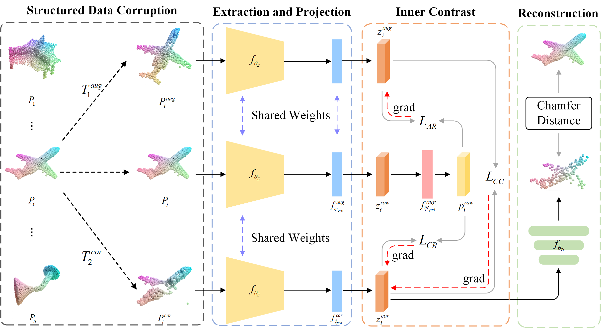

# CCPoint: Contrasting Corrupted Point Clouds for Self-Supervised Representation Learning
This repository contains the official code release of **CCPoint: Contrasting Corrupted Point Clouds for Self-Supervised Representation Learning** (IEEE TMM 2025).

## Introduction
In this work, we propose a novel SSL paradigm for point cloud representation learning, called CCPoint, which incorporates a novel form of data corruption as a negative augmentation strategy.




## 1. Installation

Pytorch >= 1.10.0;
python >= 3.7;
CUDA >= 11.1;

```
# Quick Start
conda create -n ccpoint python=3.8 -y
conda activate ccpoint

conda install pytorch==1.10.0 torchvision==0.11.0 cudatoolkit=11.3 -c pytorch -c nvidia
```

```
# Install basic required packages
pip install -r requirements.txt

# Chamfer Distance
cd ./extensions/chamfer_dist && python setup.py install --user
```

## 2. Data Preparation
We use ShapeNet, ScanObjectNN, ModelNet40 and ShapeNetPart in this work. See [DATASET.md](./DATASET.md) for details.


## 3. CCPoint Pre-training
Run the following command to pre-train the DGCNN model on ShapeNet:
```
CUDA_VISIBLE_DEVICES=0,1,2,3 python train.py --exp exp --batch_size 32 --world_size 4 --corrupt_affine affine_r5 \
--corrupt_extra random_masking --extra_level 4 --epoch 100 --master_port 12345
```

PointNet++
```
CUDA_VISIBLE_DEVICES=0,1,2,3 python train.py --exp exp --batch_size 32 --world_size 4 --corrupt_affine affine_r5 \
--corrupt_extra random_masking --extra_level 4 --epoch 100 --master_port 12345 --model pointnet_cls
```

DGCNN (ShapeNet Part Segmentation)
```
CUDA_VISIBLE_DEVICES=0,1,2,3 python train.py --exp exp --batch_size 64 --world_size 4 --corrupt_affine affine_r5 \
--corrupt_extra random_masking --extra_level 4 --model dgcnn_part
```

Note: Use 4x NVIDIA 3090Ti GPUs for optimal performance due to random augmentation strategies. Both **random mixing** and **masking** prove to be effective techniques.

## 4. Downstream Tasks

### 4.1. 3D Object Classification 
Run the following command to perform 3D object classification using linear SVM on the ModelNet40 and ScanObjectNN datasets:
```
CUDA_VISIBLE_DEVICES=0,1 python ./downstream/classification/main.py --exp exp --batch_size 32 \
--world_size 2 --pretrain_path ./output/pretrain/dgcnn_cls/exp/models/checkpoint_best.pth.tar \
--master_port 12345
```

### 4.2. 3D Object Part Segmentation
Run the following command to fine-tune the DGCNN model for part segmentation on the ShapeNetPart dataset:
```
CUDA_VISIBLE_DEVICES=0 python ./downstream/segmentation/main_partseg.py --exp exp --batch_size 32 \
--world_size 1 --pretrain_path ./output/pretrain/dgcnn_part/exp/models/checkpoint_best.pth.tar \
--master_port 12345 --scheduler Step
```

### 4.3. Few-shot Learning
Use the following command to evaluate the performance of the DGCNN model in a few-shot learning setup on the ModelNet40 dataset:
```
CUDA_VISIBLE_DEVICES=0 python eval_fewshot.py \
--pretrain_path ./output/pretrain/dgcnn_cls/exp/models/checkpoint_best.pth.tar \
--k_way 5 --m_shot 10 --n_runs 10 --dataset modelnet40
```

### 4.4. Zero-shot Learning
Run the following command to test the DGCNN model in a zero-shot learning scenario:
```
CUDA_VISIBLE_DEVICES=0 python test.py
```

## 5. Citation
If you entrust our work with value, please consider giving a star ⭐ and citation:
```
@article{}
```

## 6. Acknowledgements
Our code borrows heavily from [CrossPoint](https://github.com/MohamedAfham/CrossPoint) repository. We thank the authors of CrossPoint for releasing their code.

## 7. License
This repository is released under MIT License.
